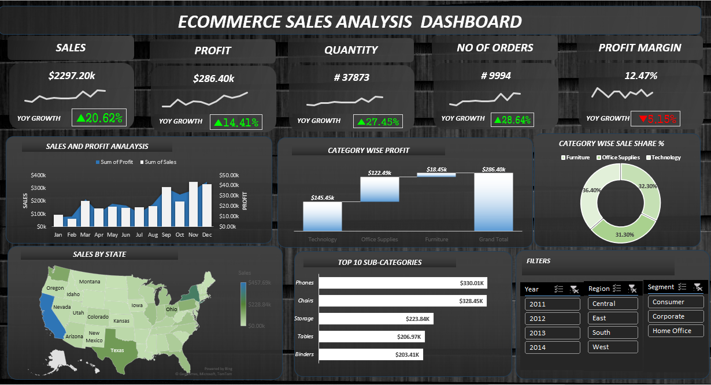

# 🛒 E-Commerce Sales Analysis Dashboard



## 📌 Project Overview

The **E-Commerce Sales Analysis Dashboard** is an Excel-based Business Intelligence project designed to analyze and visualize e-commerce sales data. The dashboard provides insights into sales performance, profitability, product categories, and regional trends through interactive charts and KPI metrics.

By transforming raw sales data into meaningful visualizations, this dashboard helps businesses make data-driven decisions and identify growth opportunities.

---

## 🎯 Objectives

- Analyze overall sales and profit performance.
- Identify top-performing product categories.
- Monitor sales trends over time.
- Compare regional and state-wise performance.
- Track important business KPIs.
- Generate actionable insights for business growth.

---

## 🛠️ Tools & Technologies Used

- Microsoft Excel
- Pivot Tables
- Pivot Charts
- Slicers
- Data Cleaning
- Data Visualization

---

## 📊 Dashboard Features

### Key Performance Indicators (KPIs)

- Total Sales
- Total Profit
- Profit Margin
- Year-over-Year (YoY) Growth

### Visualizations

- Monthly Sales vs Profit Trend Analysis
- Category-wise Profit Analysis
- Sales Distribution by Category
- State-wise Sales Performance
- Top 5 Product Categories
- Year-over-Year Growth Comparison

### Interactive Elements

- Dynamic Filters
- Slicers
- Interactive Dashboard Navigation

---

## 📂 Dataset Information

The dataset includes:

- Order Details
- Product Categories
- Sales Revenue
- Profit
- Quantity Sold
- Discount Information
- Customer Information
- Regional & State Data

---

## 📈 Key Insights

- Technology products generated the highest profit.
- Sales showed steady growth over time.
- A few states contributed significantly to total revenue.
- Top product categories accounted for a major share of sales.
- Profitability varied across different categories and regions.

---

## 🚀 How to Use

1. Download the Excel workbook.
2. Open the file in Microsoft Excel.
3. Navigate to the Dashboard worksheet.
4. Use the slicers and filters to explore the data.
5. Analyze KPIs and visualizations for insights.

---

## 📁 Project Structure

```text
ECOMMERCE-SALES-DASHBOARD/
│
├── PROJECT 2 ECOMMERCE SALES ANALYSIS.xlsx
├── dashboard.png
└── README.md
```

---

## 💡 Business Value

This dashboard helps businesses:

- Monitor sales performance effectively.
- Identify profitable products and categories.
- Understand customer purchasing trends.
- Support strategic decision-making.
- Improve overall business performance.

---

## 🔮 Future Enhancements

- Real-time Data Integration
- Sales Forecasting
- Customer Segmentation
- Automated Reporting
- Advanced Analytics Dashboard

---

## 👨‍💻 Author

**Ravish Sharma**

GitHub: https://github.com/ravish1107

---


